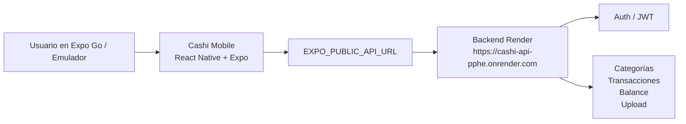
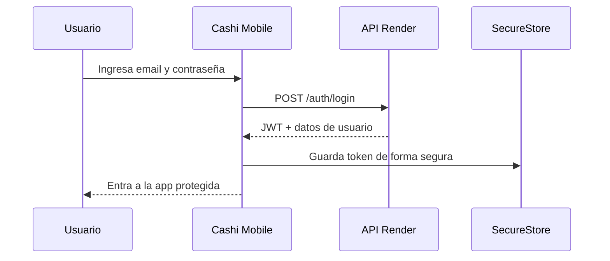
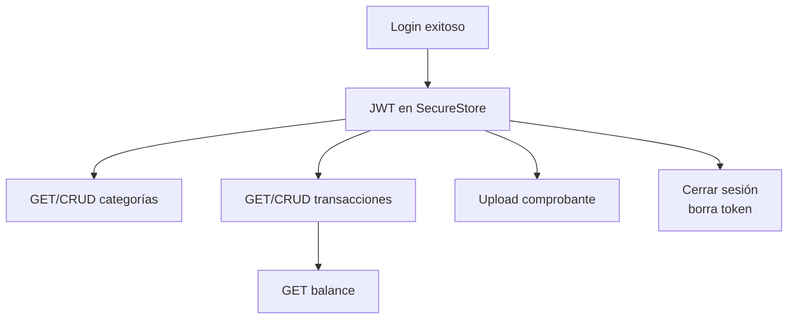

# Guía de video: Cashi Mobile conectado a Render

Esta guía resume qué explicar y qué mostrar en el video final de Cashi Mobile. El foco es demostrar que la app móvil ya consume el backend productivo desplegado en Render, mantiene sesión con JWT y usa endpoints protegidos para categorías, transacciones, balance y carga de comprobantes.

## 1. Objetivo de la demo

Decir:

> “El objetivo de esta entrega es mostrar Cashi Mobile funcionando contra el backend productivo en Render. La app ya no depende de datos locales para el flujo principal: inicia sesión contra la API, guarda el JWT de forma segura y usa ese token para consultar y modificar información financiera real del usuario.”

Backend usado en la demo:

```txt
https://cashi-api-pphe.onrender.com
```

Verificación rápida del backend:

```txt
GET https://cashi-api-pphe.onrender.com/health
```

## 2. Arquitectura general



Explicar:

> “La app está hecha con React Native y Expo. La URL del backend se configura con `EXPO_PUBLIC_API_URL`, lo que permite apuntar la misma app a Render sin dejar URLs o secretos sensibles escritos dentro del código. Desde ahí, el cliente HTTP centraliza las llamadas a la API.”

## 3. Configuración de entorno

Para la demo, la variable debe apuntar al backend de Render:

```env
EXPO_PUBLIC_API_URL=https://cashi-api-pphe.onrender.com
```

En PowerShell:

```powershell
$env:EXPO_PUBLIC_API_URL="https://cashi-api-pphe.onrender.com"
npx expo start --clear
```

Decir:

> “La configuración queda fuera del código fuente. El repositorio tiene `.env.example` para documentar la variable, pero no se deben commitear credenciales reales ni secretos.”

## 4. Login, JWT y SecureStore



Explicar:

> “En el login, la app envía el correo y contraseña a `/auth/login`. Si la autenticación es correcta, el backend responde con un JWT. Ese token se guarda en `SecureStore`, no en una variable global ni en texto plano, para mantener la sesión entre aperturas de la app.”

Credenciales demo para la grabación:

```txt
Email: render-smoke-1781316634@example.com
Password: RenderSmoke123!
```

## 5. Authorization header en endpoints protegidos

Después del login, las llamadas protegidas envían el token así:

```http
Authorization: Bearer <jwt>
```

Decir:

> “El JWT se adjunta automáticamente como `Authorization: Bearer`. Esto se usa en categorías, transacciones, balance y carga de comprobantes. Si el usuario cierra sesión, el token se borra y la app vuelve al flujo de login.”

## 6. Integraciones que se deben mostrar

| Área | Qué demostrar | Qué explicar |
| --- | --- | --- |
| Categorías | Abrir la sección y ver datos cargados | Las categorías vienen del backend y requieren JWT. |
| Transacciones | Crear, editar o listar movimientos | Los ingresos/egresos se sincronizan con la API. |
| Balance | Abrir el tab de balance | La app consulta el resumen financiero del backend. |
| Upload | Adjuntar comprobante a una transacción | La imagen se sube antes de guardar la transacción y se envía la URL resultante. |
| Logout | Cerrar sesión | Se elimina el JWT y se bloquea el acceso a pantallas protegidas. |

Flujo simplificado:



## 7. Guion práctico de demo manual

1. Mostrar que `EXPO_PUBLIC_API_URL` apunta a Render.
2. Iniciar la app con `npx expo start --clear`.
3. Abrir Cashi Mobile en Expo Go o emulador.
4. Iniciar sesión con las credenciales demo.
5. Confirmar que la app navega a las pantallas principales.
6. Abrir categorías y explicar que son datos protegidos por JWT.
7. Abrir transacciones y crear o editar un movimiento.
8. Adjuntar un comprobante si se quiere mostrar el flujo de upload.
9. Abrir balance y explicar que el resumen viene de la API.
10. Cerrar sesión y mostrar que vuelve al login.

Frase de cierre sugerida:

> “Con esto queda validado el flujo completo: configuración por entorno, autenticación real contra Render, persistencia segura del JWT, consumo de endpoints protegidos y cierre de sesión.”

## 8. Archivos exactos para mostrar código en el video

Si durante la presentación se pide mostrar código, usar este orden para no perder tiempo:

1. `final-mobile.md`
   - Usarlo como guion general de la demo.
   - Mostrar backend Render, credenciales demo, flujo manual y validaciones.

2. `src/api/config.ts`
   - Mostrar que la app lee `EXPO_PUBLIC_API_URL`.
   - Explicar que la URL de Render se configura por entorno y no queda hardcodeada como secreto.

3. `src/api/client.ts`
   - Mostrar `POST /auth/login`.
   - Mostrar el header `Authorization: Bearer <token>`.
   - Mostrar endpoints protegidos: categorías, transacciones, balance y upload.

4. `src/storage/authTokenStorage.ts`
   - Mostrar que el JWT se guarda con `expo-secure-store`.
   - Explicar que no se usa `localStorage` ni almacenamiento inseguro para la sesión.

5. `src/contexts/AuthContext.tsx`
   - Mostrar el flujo de `login`, restauración de sesión y `logout`.
   - Explicar que al cerrar sesión se borra el token y la app vuelve al login.

6. `src/repositories/backendRepositories.ts`
   - Mostrar que categorías, transacciones, balance y comprobantes pasan por repositorios conectados al backend.
   - Explicar que la UI no llama directo a `fetch`; usa una capa de repositorios.

Resumen rápido para decir mientras se muestran los archivos:

> “Primero configuro la URL productiva con `EXPO_PUBLIC_API_URL`. Luego el cliente HTTP hace login contra `/auth/login`, guarda el JWT con `SecureStore` y agrega `Authorization: Bearer` en las llamadas protegidas. Las pantallas consumen categorías, transacciones, balance y upload mediante repositorios, separando UI de integración con backend.”

## 9. Validación automatizada realizada

Antes de la entrega se ejecutaron estas verificaciones:

```bash
npm test -- --runInBand
npm run typecheck
npm run test:coverage -- --runInBand
```

Resultado reportado:

```txt
31 suites / 137 tests aprobados
Typecheck aprobado
Coverage ejecutado correctamente
```

Explicar:

> “Además de la prueba manual en dispositivo o emulador, se validaron tests automatizados, typecheck de TypeScript y cobertura. Esto cubre el comportamiento esperado del cliente, incluyendo login, rutas protegidas, logout e integración con servicios.”

## 10. Limitaciones y advertencias

- La verificación final del video debe hacerse manualmente en Expo Go, emulador o dispositivo físico, porque cámara, galería, ubicación y red dependen del entorno real.
- No se deben hardcodear secretos ni credenciales reales en el código. Las credenciales demo son solo para la validación del video.
- Si Render está frío, la primera llamada puede tardar más de lo normal mientras el servicio despierta.
- Si el backend no responde, la app debe mostrar un error amigable y no romper la navegación.
- Si se prueba upload, confirmar permisos de galería/cámara en el dispositivo o emulador.

## 11. Resumen para decir al final

> “Cashi Mobile queda conectado al backend productivo de Render mediante `EXPO_PUBLIC_API_URL`. El usuario inicia sesión en `/auth/login`, el JWT se guarda con SecureStore y todas las operaciones protegidas usan `Authorization: Bearer`. La app integra categorías, transacciones, balance y carga de comprobantes. La entrega fue validada con pruebas automatizadas, typecheck y una verificación manual recomendada en dispositivo o emulador.”
